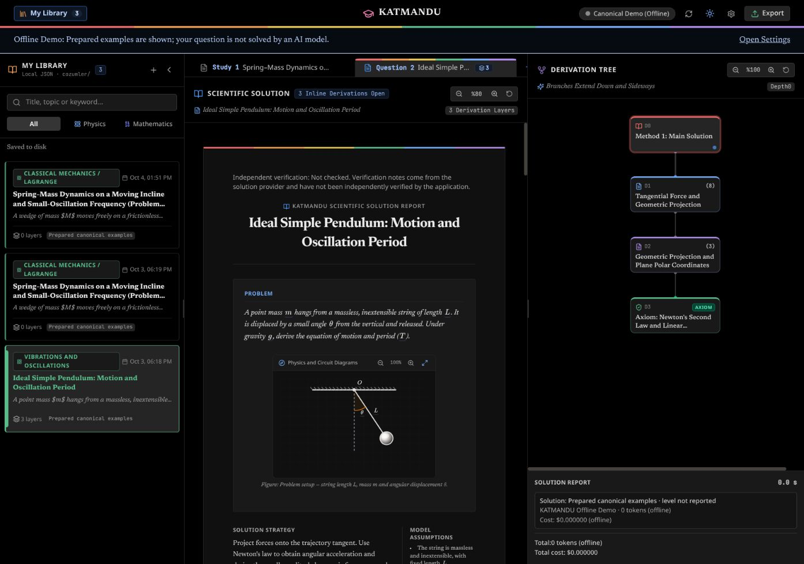

<!-- Generated together from docs/readme.content.json. Edit both languages there and run npm run docs:sync. -->

# KATMANDU

[English README](README.md)

## Bilimsel çözüm ve türetim

KATMANDU, üniversite düzeyinde fizik ve matematik için yapay zekâ destekli bir çalışma ortamıdır. Çözümleri denklemler, şemalar ve etkileşimli türetimlerle akademik belge olarak sunar. Bir adımı derinleştirebilir, bağlamsal soru sorabilir, alternatif yöntemleri karşılaştırabilir ve tüm çalışmayı yerel olarak saklayabilirsiniz.

React, TypeScript, Vite, Tailwind CSS ve KaTeX ile geliştirilmiştir.

## Önizleme

Siyah çalışma alanı, gökkuşağı vurgu paleti, yerinde matematiksel türetimler ve dallanan çözüm ağacı. Önizlemede soru metni, çözüm ve türetim başlıkları dahil İngilizce çevrimdışı demo örnekleri kullanılır.



## Özellikler

- Metin veya LaTeX girin, görsel ya da PDF yükleyin.
- Bağımsız soruları tespit edip ayrı sekmelerde çözün; a), b), c) gibi bağlı alt maddeleri koruyun.
- Yerinde türetim katmanlarını, şemaları, varsayımları, kurucu yasaları ve alternatif yöntemleri inceleyin.
- Sağlayıcıyı ve modeli kendiniz seçin; sorular otomatik algılanır, otomatik model yönlendiricisi çalışmaz.
- OpenAI, Google Gemini, DeepSeek ve OpenRouter için güncel model kataloglarını kullanın. OpenRouter modelleri şirketlere göre gruplar.
- Çalışmaları kaynakları, ekleri, türetim ağaçları ve işlem raporlarıyla okunabilir JSON dosyalarına kaydedin.
- Tekli veya birleşik çalışmaları A4 baskı/PDF veya bağımsız LaTeX kaynağı olarak dışa aktarın.
- Düzeni değiştirmeden İngilizce (varsayılan) veya Türkçe kullanın.

## Başlangıç

Gereksinimler: **Node.js 22.13 veya üzeri** ve npm.

```bash
npm ci
npm run dev
```

`http://127.0.0.1:5173` adresini açın (port doluysa Vite’ın yazdığı adresi kullanın).

```bash
npm run build
npm run preview
```

`build`, yerel arşiv sunucusu dahil TypeScript kontrolünü yapar ve üretim paketini oluşturur. `preview`, bu paketi yerel JSON arşiv API’siyle sunar. Yalnızca statik dosya sunan bir barındırma hizmeti yerel dosya sisteminize yazamadığından arşivler tarayıcı deposunda tutulur.

## Proje klasöründen başlatma

- **Linux:** Proje klasöründe `./KATMANDU_BASLAT.sh` komutunu çalıştırın (veya dosya yöneticisinin “Terminalde çalıştır” seçeneğini kullanın). Eksik bağımlılıklar kurulur ve sunucu hazır olunca tarayıcı açılır.
- **Windows:** `KATMANDU_BASLAT.bat` dosyasına çift tıklayın.
- **macOS:** Finder’da `KATMANDU_BASLAT.command` dosyasına çift tıklayın veya Terminal’de `bash KATMANDU_BASLAT.command` çalıştırın. ZIP indirirken çalıştırma izni kaybolmuşsa önce `chmod +x KATMANDU_BASLAT.command` çalıştırın.

Linux başlatıcısı dal değiştirmeden mevcut Git dalını gösterir, `127.0.0.1:5173` adresini kullanır ve sessizce başka porta geçmez. Çalışırken tekrar açılırsa mevcut adres tarayıcıda açılır. Terminalde `Ctrl+C` ile durdurulur. Mevcut yerel `KATMANDU.desktop` kısayolu kullanılmaya devam edilebilir; bilgisayara özel yol içerdiğinden Git dışında tutulur.

Tüm başlatıcılar Node.js 22.13 veya üzerini gerektirir; sunucuyu `127.0.0.1:5173` üzerinde tutar. macOS başlatıcısı tarayıcıyı Vite ile açar ve Linux’a özgü araçlar gerektirmez.

## Platform ve mobil tarayıcı desteği

Windows, Linux ve macOS için tasarlanmıştır; şu anda test edilen platform Linux’tur. Windows ve macOS başlatıcıları sağlanır; bu sistemlerde gerçek cihaz testleri henüz yapılmamıştır.

1200 pikselden dar ekranlarda **Çözüm**, **Kütüphanem** ve **Dallanma Ağacı** ayrı çalışma alanı görünümleri olarak açılır. Dokunmaya uygun kontroller, kaydırılabilir pencereler ve denklem türetim düğmeleri telefon/tablet kullanımını destekler. Baskı/PDF, A4 düzenini korur. Tarayıcı ekran boyutu kontrolleri fiziksel iOS/Android cihaz testlerinin yerini tutmaz.

Android/iOS için yerel kurulum paketi yoktur. Telefonun çalışan bir web uygulamasına erişmesi gerekir; telefona Node.js kurulması gerekmez. Telefondaki `127.0.0.1`, telefonun kendisini gösterir. Ağ paylaşımı açıkça etkinleştirilir ve kullanıcı kimlik doğrulaması içermez; yerel sunucuyu dışarı açmadan önce gizlilik bölümünü okuyun.

## Dil

İlk açılışta İngilizce varsayılandır. Türkçe için **Ayarlar → Dil → Türkçe** seçin; tercih bu tarayıcıda hemen kaydedilir.

Arayüz etiketleri, mesajlar, matematiksel ipuçları, hazır demo içerikleri ve dışa aktarma başlıkları seçilen dili kullanır. Gerçek sağlayıcılar sorunun dilini otomatik algılar; sorunun dili ne olursa olsun yeni çözümleri, soru açıklamalarını ve türetimleri seçilen uygulama dilinde üretmeleri istenir. Her istek başladığı andaki dili korur; yeni çözümün kaynak bilgisine dil de kaydedilir. Kayıtlı çözümler özgün metinlerini ve kaynak bilgilerini korur; arayüz dilini değiştirmek eski çalışmaları veya kullanıcı girdilerini çevirmez.

## Sağlayıcılar ve model seçimi

Sağlayıcıyı, API anahtarını ve modeli **Ayarlar** bölümünden yapılandırın. Eksik veya yalnızca boşluklardan oluşan anahtarlar gerçek işlemleri görünür mesajla engeller; demo otomatik açılmaz. API çağrısı yapmadan hazır örnekleri denemek için **Çevrimdışı Demo** seçeneğini açıkça seçin.

Anahtarı girilmiş sağlayıcıların model listeleri uygulama açılışında yenilenir. Listeler yerelde 24 saat önbelleğe alınır ve elle yenilenebilir; model kimliği doğrudan da girilebilir. Hesaba bağlı kullanılabilirlik, fiyat ve giriş biçimleri sağlayıcı kataloğundan gelir ve değişebilir. Seçiminizi **Bağlantıyı Sına** ile kontrol edin. OpenAI, Chat Completions ve Responses protokollerini destekler; uç nokta gerektirdiğinde Responses’a geçilir.

**Model seçimi şu anda yalnızca elle yapılır.** Ayarlar’dan sağlayıcıyı ve modeli seçin. Bağımsız sorular otomatik algılanmaya devam eder ve seçtiğiniz modelle çözülür. Otomatik model önerisi yönlendirme sorunları nedeniyle geçici olarak devre dışıdır; öneri modeli çağrısı veya onay penceresi açılmaz. Deneysel yönlendirme kodu ileride düzeltilerek yeniden eklenmek üzere korunur.

## Yerel arşiv ve işlem raporları

`npm run dev` veya `npm run preview` ile tamamlanan çalışmalar **`solutions/`** altında ayrı JSON dosyalarına kaydedilir. Mevcut tarayıcı kayıtları yerel sunucuya ilk başarılı bağlantıda taşınır. Tarayıcı deposu çevrimdışı yedek olarak korunur.

Güncellemeden sonraki ilk arşiv işleminde eski `cozumler/` klasöründeki JSON dosyaları içerikleri ve kimlikleri değiştirilmeden `solutions/` klasörüne taşınır. Çakışan eski dosyalar `solutions/legacy-cozumler/` altında korunur; `solutions/` içindeki mevcut dosya etkin kalır. Yedekler mükerrer çalışma olarak listelenmez.

Disk erişimi başarısızsa kayıt, silme ve temizleme kalıcı kuyruğa alınır; bağlantı dönünce, uygulama yeniden açılınca veya 30 saniyede bir yeniden denenir. Arşiv paneli bekleyen işleri ve hataları gösterir. Kuyruk mevcut tarayıcı profiline bağlıdır. Kayıtlarda `schemaVersion` ve `updatedAt` bulunur; geçmiş model/tarih bilgileri korunur. Liste 50 kayıtlık özet sayfaları yükler; açıldığında tam doküman getirilir.

Her türetim ağacının altındaki küçük **Çözüm raporu**, soru tespiti/çözüm modellerini (eski raporlarda öneri modellerini de), akıl yürütme seviyelerini, kullanıcı onayı beklemesi hariç işlem süresini, API’nin bildirdiği tokenları ve varsa ücreti gösterir. Bilinmeyen token/ücret verisi bilinmeyen olarak kalır. Ortak çağrılar paylaşılan olarak işaretlenir; çoklu soruların raporları toplanmamalıdır. Rapor, sorunun JSON dosyasında `document.executionReport` alanına kaydedilir. Eski çalışmalara tahmini geçmiş rapor eklenmez. Çözümün içinde yalnızca çözümü yapan model ve tarih görünür.

## Doğrulama, işlem sınırları ve gizlilik

Sağlama açıklamaları çözüm modelinden gelir. KATMANDU şu anda bağımsız sembolik cebir/CAS denetimi çalıştırmaz; arayüz ve çıktılar bu açıklamaları **Kontrol edilmedi** olarak gösterir. Eksik açıklamalar başarılı doğrulama iddiasına dönüştürülmez.

Sekme kapatma, yerine yeni istek başlatma veya **Durdur** düğmesi mevcut işlemi iptal eder ve geç gelen yanıtın güncel çalışmanın yerine geçmesini önler. İptal, sağlayıcının zaten işlediği isteklerin ücretini geri almaz.

Ayarlar’da eşzamanlı işlem sayısı (varsayılan 2), zaman aşımı (kuyruk dahil varsayılan 300 saniye) ve soru başına tahmini USD sınırı (0 kapatır) bulunur. Sınır açıkken katalog fiyatı bilinmeyen istekler engellenir ve çağrı öncesi tahmini girdi/çıktı payları kontrol edilir. Bilinen ortak soru tespiti maliyetleri de dahildir. Bu, uygulama tarafı tahminidir; sağlayıcının uyguladığı kesin fatura sınırı değildir.

OpenRouter, en fazla 20 sayfalık PDF’lerin tüm sayfalarını görüntüleyip gönderir; daha uzun veya okunamayan belgeler açık hatayla durur. OpenAI gerçek PDF dosya baytlarını gönderir. Model veya uç nokta verilen biçimi desteklemelidir.

API çağrıları tarayıcıdan seçilen sağlayıcıya doğrudan gider; anahtarlar tarayıcı ayarlarında tutulur. Kullanılan girdi ve ekler o sağlayıcıya gönderilir. `VITE_*` ortam değerleri tarayıcı paketlerine dahil edilir. Üretim derlemesi, dolu `VITE_*_API_KEY`, token, parola veya gizli değer değişkenlerini reddeder; derlemeden önce bunları kaldırıp anahtarları Ayarlar’dan girin. Gemini anahtarı URL yerine `x-goog-api-key` başlığında gönderilir. Tarayıcı deposu şifreli bir anahtar kasası değildir; uygulamanın kaynağında çalışan betikler kayıtlı anahtarları okuyabilir. Hizmet sahibinin anahtarını kullanan ortak bir servis için ayrı, kimlik doğrulamalı arka uç gerekir. Yerel arşivler, ortam dosyaları ve özel deneme/tasarım klasörleri Git dışında tutulur; geliştirme sunucusunda doğrudan dosya erişimine kapatılır.

Geliştirme ve önizleme sunucuları varsayılan olarak `127.0.0.1` üzerinde dinler. `KATMANDU_SHARE_NETWORK=1 npm run dev`, arşiv erişimi dahil ağ paylaşımını kullanıcı kimlik doğrulaması olmadan açıkça etkinleştirir. Arşiv API’si farklı sitelerden gelen istekleri reddeder ve değişiklik işlemleri için uygulama başlığını zorunlu tutar.

Sağlayıcı istekleri, katalog yenilemeleri ve bağlantı testleri HTTPS gerektirir; HTTP yalnızca yerel proxy adreslerinde (`localhost`, `127.0.0.1`, `[::1]`) kullanılabilir. Kullanıcı adı/parola içeren adresler ve HTTP yönlendirmeleri reddedilir. Özel uç noktalar girdilerinizi ve anahtarlarınızı alır; yalnızca güvendiğiniz adresleri yapılandırın. Arşiv API’si DNS rebinding saldırılarını engellemek için Host başlığını da doğrular; özel alan adları Vite’ın `server.allowedHosts` veya `preview.allowedHosts` listesinde açıkça tanımlanmalıdır. Hatalarda arşiv içerikleri veya sunucu yolları döndürülmez.

## Geliştirme ve iki dilli dokümantasyon

```bash
npm test
npm run build
npm run docs:sync
npm run docs:check
```

Testler sahte HTTP yanıtlarıyla sağlayıcı isteklerini, çalışan uygulama akışlarını, tarayıcı/disk deposunu, iptali, dışa aktarmayı ve iki dili kapsar. Ücretli API çağrısı veya LaTeX derleyicisi gerekmez.

**İki README’yi birlikte güncelleyin:** [`docs/readme.content.json`](docs/readme.content.json) dosyasında değişen her bölümün hem `en` hem `tr` sürümünü düzenleyip `npm run docs:sync` çalıştırın. Üretici, ana İngilizce README ile `README.tr.md` dosyasını birlikte yazar. `npm test`, önce `docs:check` çalıştırır; dosyalardan biri güncel değilse başarısız olur. Yeni arayüz metnini Türkçe kaynağıyla `src/i18n/en.json` içine ekleyin; dil ve yer tutucu regresyon testleri kataloğu denetler.

## Lisans

[MIT Lisansı](LICENSE) ile lisanslanmıştır. Telif hakkı © 2026 Mesut Kaval.
